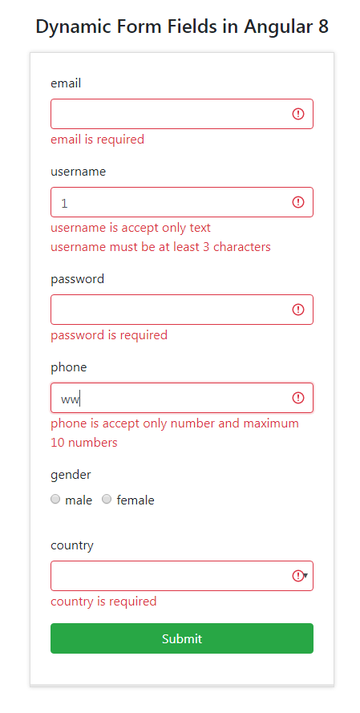

# Run Application
```
ng serve
localhost:4200/
```



# Reactive form controls (Taken help from these tutorials)

https://stackblitz.com/edit/dynamic-form-generate-from-json-angular-2-reactive-form?file=src%2Fapp%2Fapp.component.ts
https://medium.com/@fabiokounang/angular-6-dynamic-form-with-reactive-form-controls-43a10176a9f1
https://dzone.com/articles/how-to-create-custom-validators-in-angular
https://jasonwatmore.com/post/2018/05/10/angular-6-reactive-forms-validation-example
https://stackblitz.com/edit/angular-6-reactive-form-validation?file=app%2Fapp.component.html

# Custom validator in Angular

Angular provides us many useful validators, including required, minLength, maxLength, and pattern. These validators are part of the Validators class, which comes with the @angular/forms package.

Let's assume you want to add a required validation to the email control and a maxLength validation to the password control. Here's how you do that:
```
this.loginForm = new FormGroup({
        email: new FormControl(null, [Validators.required]),
        password: new FormControl(null, [Validators.required, Validators.maxLength(8)]),
        age: new FormControl(null)
    });
``` 
To work with validators, make sure to import them into the component class:

```
import { FormGroup, FormControl, Validators } from '@angular/forms';
```

On the template, you can use validators to show or hide an error message. Essentially, you are reading formControl using the get() method and checking whether it has an error or not using the hasError() method. You are also checking whether formControl is touched or not using the touched property.   

### Validate form on submission in reactive-form

You can actually achieve this already with the submitted flag on the top level form directive. create form directive using #formDir="ngForm" and then check
form is submitted or not using "formDir.submitted" checking. "formDir.submitted" will return you boolean value true or false.


#### Static reactive form validation (Email)

```
<div class="col-12 form-group">
  <label>email</label>
  <input type="email" formControlName="email" class="form-control" [ngClass]="{'is-invalid' : registerForm.get('email').errors && formDir.submitted }">
  <div *ngIf="!registerForm.get('email').valid && registerForm.get('email').errors && formDir.submitted">
    <span class="error" *ngIf="registerForm.get('email').errors.hasOwnProperty('required')">email is required</span>
    <span class="error" *ngIf="registerForm.get('email').errors.hasOwnProperty('email')">email must be valid</span>
  </div>
</div>
``` 

#### Dynamic reactive form validation (Email)

```
<div class="col-12 form-group">
  <label>{{form.key}}</label>
  <input [type]="form.input" [formControlName]="form.key" class="form-control" [ngClass]="{'is-invalid' : registerForm.get(form.key).errors && formDir.submitted }">
  <div *ngIf="!registerForm.get(form.key).valid && registerForm.get(form.key).errors && formDir.submitted">
    <div *ngFor="let err of form.valids; let k = index">
      <span class="error" *ngIf="registerForm.get(form.key).errors.hasOwnProperty(err.valid)">{{err.error}}</span>
    </div>
  </div>
</div>
```

OR

```
<div class="col-12 form-group">
  <label>{{form.key}}</label>
  <input [type]="form.input" [formControlName]="form.key" class="form-control" [ngClass]="{'is-invalid' : registerForm.get(form.key).errors && formDir.submitted }">
  <div *ngIf="!registerForm.get(form.key).valid && registerForm.get(form.key).errors && formDir.submitted">
    <div *ngFor="let err of form.valids; let k = index">
      <span class="error" *ngIf="registerForm.get(form.key).hasError(err.valid)">{{err.error}}</span>
    </div>
  </div>
</div>
```

### JSOn Form Data
```
this.formFields = [
      {
        key: 'email',
        input: 'email',
        valids: [
          {
            valid: 'required',
            error: 'email is required'
          },
          {
            valid: 'email',
            error: 'email must be valid'
           }
        ]
      },
      {
        key: 'username',
        input: 'text',
        valids: [
          {
            valid: 'required',
            error: 'username is required'
          },
          {
            valid: 'pattern',
            validator: '^[a-zA-Z]+$',
            error: 'username is accept only text'
          },
          {
            valid: 'minlength',
            length: 3,
            error: 'username must be at least 3 characters'
          }
        ]
      },
      {
        key: 'password',
        input: 'password',
        valids: [
          {
            valid: 'required',
            error: 'password is required'
          },
          {
            valid: 'minlength',
            length: 6,
            error: 'Password must be at least 6 characters'
          }
        ]
      },
      {
        key: 'phone',
        input: 'text',
        valids: [
          {
            valid: 'required',
            error: 'phone is required'
          },
          {
            valid: 'pattern',
            validator: '^[0-9]{10}$',
            error: 'phone is accept only number and maximum 10 numbers '
          }
        ]
      },
      {
        key: 'gender',
        input: 'radio',
        items: [
          {
            name: 'male',
            id: 0
          },
          {
            name: 'female',
            id: 1
          }
        ],
        valids: []
      },
      {
        key: 'country',
        input: 'select',
        items: [
          {
            name: 'india',
            id: 0
          },
          {
            name: 'bangladesh',
            id: 1
          }
        ],
        valids: [
          {
            valid: 'required',
            error: 'country is required'
          }
        ]
      }
    ];
    ```

    ### ValidatorFn
    A function that receives a control and synchronously returns a map of validation errors if present, otherwise null.

    We have a few built in validators in Angular:

      1. required
      2. minlength
      3. maxlength
      4. pattern

    Creating a custom validator for reactive forms is actually more simple than for a template driven form. You only need to implement ValidatorFn, which takes a form control and returns an error object.

     ```
    const validatorsArr: ValidatorFn[] = [];
      if (element.valids.length > 0) {

        element.valids.forEach(val => {
          if (val.valid === 'required') {
            validatorsArr.push(Validators[val.valid]);
          }
          if (val.valid === 'pattern') {
            validatorsArr.push(
              Validators.pattern(val.validator)
            );
          }
          if (val.valid === 'minlength') {
            validatorsArr.push(
              Validators.minLength(val.length)
            );
          }
        });

        this.registerForm.addControl(element.key, new FormControl('', validatorsArr));
     ```

     validatorsArr is used to store validators controls for each fields. 

